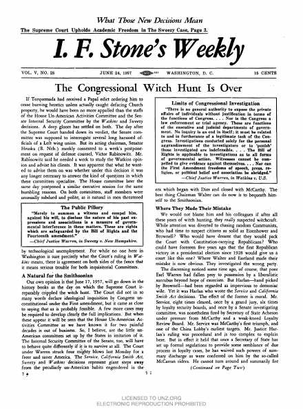
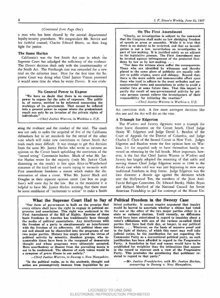
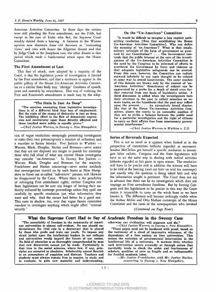
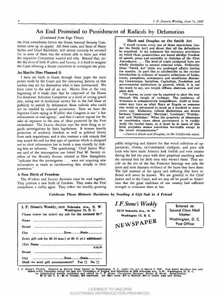

# murguia.github.io

## I.F. Stone's Weekly

A look at what the newsletter looks like — the June 24, 1957 issue (Vol. V No. 25). Click any page to open the original PDF on [ifstone.org](https://www.ifstone.org).

  
  
  
  

